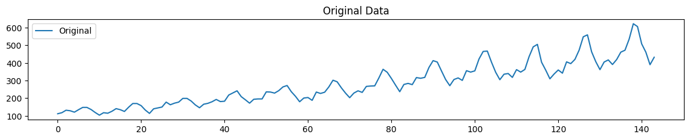

# Ex.No: CONVERSION OF NON STATIONARY TO STATIONARY DATA

### AIM:
To perform regular differncing,seasonal adjustment and log transformatio on international airline passenger data
### ALGORITHM:
1. Import the required packages like pandas and numpy
2. Read the data using the pandas
3. Perform the data preprocessing if needed and apply regular differncing,seasonal adjustment,log transformation.
4. Plot the data according to need, before and after regular differncing,seasonal adjustment,log transformation.
5. Display the overall results.
### PROGRAM:
```py
import pandas as pd
import numpy as np
import matplotlib.pyplot as plt
from statsmodels.tsa.seasonal import seasonal_decompose

# Load the data
data = pd.read_csv("AirPassengers.csv")
# Create DataFrame
df = pd.DataFrame(data)

# Regular differencing
df['Regular Difference'] = df['#Passengers'].diff()

# Seasonal adjustment
result = seasonal_decompose(df['#Passengers'], model='additive', period=12)
df['Seasonal Adjustment'] = result.resid

# Log transformation
df['Log Transformation'] = np.log(df['#Passengers'])

# Plotting
plt.figure(figsize=(14, 10))

plt.subplot(4, 1, 1)
plt.plot(df['#Passengers'], label='Original')
plt.legend(loc='best')
plt.title('Original Data')

plt.subplot(4, 1, 2)
plt.plot(df['Regular Difference'], label='Regular Difference')
plt.legend(loc='best')
plt.title('Regular Differencing')

plt.subplot(4, 1, 3)
plt.plot(df['Seasonal Adjustment'], label='Seasonal Adjustment')
plt.legend(loc='best')
plt.title('Seasonal Adjustment')

plt.subplot(4, 1, 4)
plt.plot(df['Log Transformation'], label='Log Transformation')
plt.legend(loc='best')
plt.title('Log Transformation')

plt.tight_layout()
plt.show()
```
### OUTPUT:
#### ORIGINAL DATA:

#### REGULAR DIFFERENCING:


#### SEASONAL ADJUSTMENT:


#### LOG TRANSFORMATION:


### RESULT:
Thus we have created the python code for the conversion of non stationary to stationary data on international airline passenger
data.
